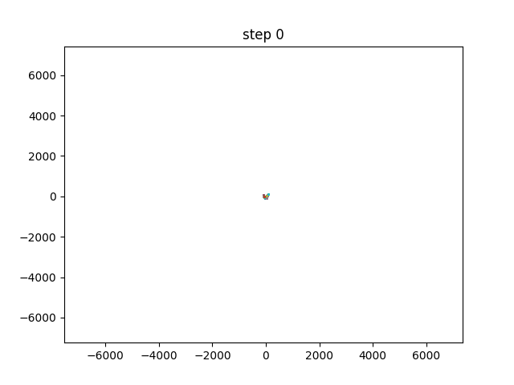

# Mini Pangenome Visualization

This is a toy program that visualizes a pangenomic graph with gradient descent method.


## Problem formulation

Each edge in the graph has two vertices, and it represents a sequence of nucleobases in the DNA. We know how these sequences are connected, how long they are, and we want to predict x, y coordinates for each vertex to visualize the graph.

## How to do that?

We let x, y coordinates be learnable parameters in a model, and minimize the error of sequence length with gradient methods like SGD in pytorch. 

## Run the demo

The demo is a very small graph with 5 vertices. 

```sh
$ python main.py
```

Runs the optimization, prints loss function, and saves a log of coordinates for visualization.

```sh
$ python visualization.py
```

Animates the coordinate optimization progress and produces a GIF. The result looks like this:


